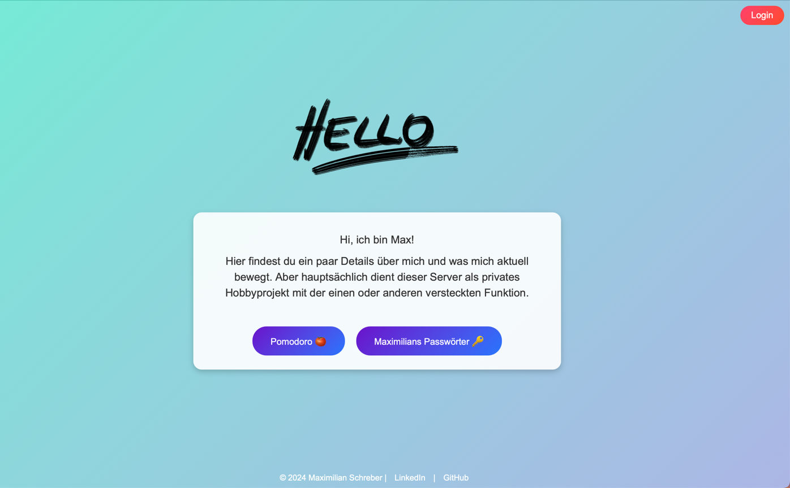
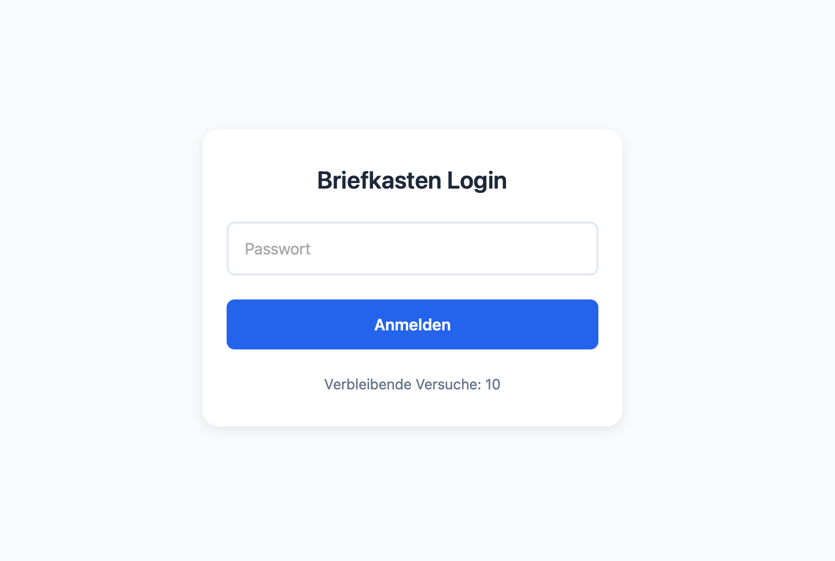
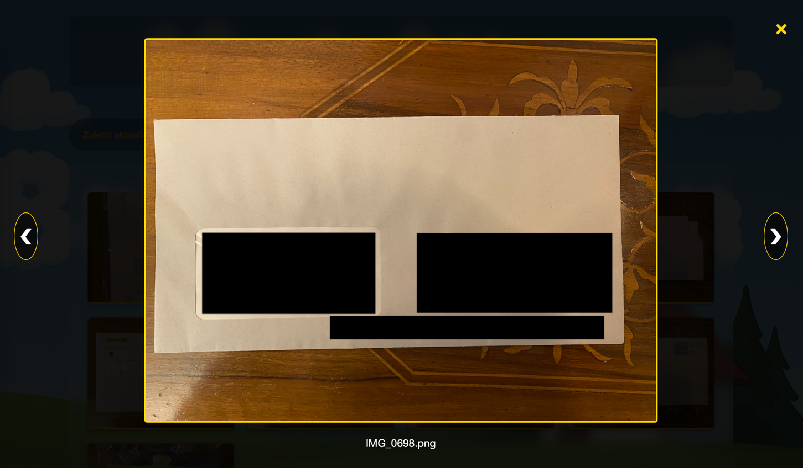

# 📬 SpringBootServer for Raspberry Pi

A lightweight personal server built with Java and Spring Boot, designed to run seamlessly on a Raspberry Pi. Originally created as a digital "mailbox" solution for shared households, this project serves as a private productivity hub with a modular architecture for future expansion.

---

## Current Use Case: Digital Mailbox (Briefkasten)

The primary feature is a **shared digital mailbox** allowing housemates to:

- View all **physical letters** delivered to the house via a central web interface.
- See each letter as a **thumbnail preview** in a gallery.
- **Zoom and open** individual letters in a dedicated viewer/player.
- Uploads are fully **automated** via an Android app that scans letters and transmits them to the Pi using an external API.

This feature is actively used in a shared household setup.

---

## Tech Stack

- 💡 **Spring Boot** (Java 17)
- 🐍 Raspberry Pi (ARM64)
- 🌐 Web frontend with HTML/CSS + Thymeleaf
- 📦 Static image hosting for scanned letters
- 📲 Integration with external Android app and API

---

## 📂 Folder Structure

```
SpringBootServer/
├── src/
│   └── main/
│       ├── java/
│       └── resources/
│           └── static/
│               └── images/
├── build.gradle
└── README.md
```

---

## 🛠️ Getting Started

### Requirements

- Java 17+
- Raspberry Pi with 64-bit OS
- Gradle (or use included wrapper)

### Running the Server

```bash
git clone https://github.com/yourusername/SpringBootServer.git
cd SpringBootServer
./gradlew bootRun
```

Server starts on `http://localhost:8080`

---

## Web UI Overview

The web application displays a clean interface with:

- 📥 Letter Gallery (`/`)
- 🖼️ Miniature previews of uploaded letters
- 🔍 Zoomable viewer on click
- 💾 Static images stored in `/static/images/`

---

## Future Modules (Planned)

This server is designed to be modular. Planned features include:

- 🏠 Smart home utilities (sensor dashboards, automation)
- 🧾 PDF utilities (merge, split, compress)
- 🚘 Hyundai Bluelink API integration
- 📁 File system browsing and transfer
- 📊 Private dashboard for personal metrics

---

## Screenshots

## 📸 Screenshots

### 🏠 Homepage


---

### 🔐 Login View


---

### 📬 Mailbox Overview


---

### 🔍 Zoomed Letter View


---

## Contributions

This is a personal project, but ideas or suggestions are welcome.  
Feel free to fork or open issues if you're working on something similar!

---

## License

MIT License

---

## Author

**Maximilian Schreber**  
Built for real-world daily use in a shared flat.  
Powered by Spring Boot, Pi, and caffeine ☕
